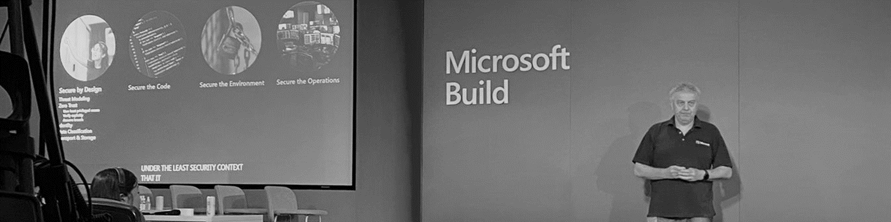

# Securing Applications

Below is the content from my Microsoft Build 2022 session on 'Securing Applications'.  I only had 15 minutes allocated to speak - this is what I squeezed in and delivered ... 

As organisations navigate digital transformation – there is no topic more important than defending yourself from attack.

Security is a complex topic because its wide ranging and has many facets – and therefore needs different skills and roles to be involved.

To be successful - organisations must eliminate the silos between the different teams, and embed a security first culture into their processes and tooling.
